```mermaid
erDiagram

    %% ─────────────────────────────────────────────
    %% CORE ENTITIES
    %% ─────────────────────────────────────────────

    users {
        UUID        id              PK
        string(128) firebase_uid    UK "Firebase identity"
        string(50)  username        UK
        string(255) email           UK
        string(50)  auth_provider       "password | google.com"
        string(500) avatar_url          "nullable"
        timestamptz created_at
        timestamptz last_seen           "nullable"
        boolean     show_last_seen      "default true"
        boolean     read_receipts_enabled "default true"
    }

    conversations {
        UUID        id              PK
        string(10)  type                "direct | group"
        string(100) name                "nullable – group only"
        string(500) description         "nullable – group only"
        UUID        created_by      FK  "→ users.id"
        integer     max_members         "default 50"
        boolean     has_messages        "default false"
        timestamptz created_at
    }

    conversation_members {
        UUID        id              PK
        UUID        conversation_id FK  "→ conversations.id"
        UUID        user_id         FK  "→ users.id"
        string(10)  role                "admin | member"
        string(10)  status              "pending | accepted | rejected"
        string(7)   color               "nullable – hex #rrggbb"
        timestamptz joined_at
        timestamptz last_read_at        "nullable"
        timestamptz deleted_at          "nullable – soft delete"
        timestamptz messages_hidden_before "nullable"
        boolean     is_muted            "default false"
    }

    messages {
        UUID        id              PK
        UUID        conversation_id FK  "→ conversations.id CASCADE"
        UUID        sender_id       FK  "→ users.id CASCADE"
        text        body                "nullable – image-only / call messages"
        string(1000) image_url          "nullable"
        string(10)  message_type        "text | call"
        jsonb       call_log            "nullable – call summary"
        string(26)  cursor_key      UK  "ULID – cursor pagination"
        timestamptz created_at
        timestamptz edited_at           "nullable"
    }

    message_receipts {
        UUID        id              PK
        UUID        message_id      FK  "→ messages.id CASCADE"
        UUID        recipient_id    FK  "→ users.id CASCADE"
        string(10)  status              "sent | delivered | read"
        timestamptz updated_at
    }

    %% ─────────────────────────────────────────────
    %% SOCIAL GRAPH
    %% ─────────────────────────────────────────────

    contacts {
        UUID        id              PK
        UUID        owner_id        FK  "→ users.id CASCADE"
        UUID        contact_user_id FK  "→ users.id CASCADE"
        timestamptz created_at
    }

    message_requests {
        UUID        id              PK
        UUID        from_user_id    FK  "→ users.id CASCADE"
        UUID        to_user_id      FK  "→ users.id CASCADE"
        string(20)  status              "pending | accepted | declined"
        timestamptz created_at
    }

    user_blocks {
        UUID        id              PK
        UUID        blocker_id      FK  "→ users.id CASCADE"
        UUID        blocked_id      FK  "→ users.id CASCADE"
        timestamptz created_at
    }

    %% ─────────────────────────────────────────────
    %% NOTIFICATIONS
    %% ─────────────────────────────────────────────

    notifications {
        UUID        id              PK
        UUID        user_id         FK  "→ users.id CASCADE"
        string(50)  type                "group_invitation | contact_request | system …"
        string(255) title
        string(1000) body
        jsonb       data                "nullable – e.g. {group_id, from_user_id}"
        timestamptz read_at             "nullable – null = unread"
        timestamptz created_at
    }

    %% ─────────────────────────────────────────────
    %% RELATIONSHIPS
    %% ─────────────────────────────────────────────

    users                ||--o{ conversations          : "creates (created_by)"
    users                ||--o{ conversation_members   : "is member of"
    conversations        ||--o{ conversation_members   : "has"
    conversations        ||--o{ messages               : "contains"
    users                ||--o{ messages               : "sends"
    messages             ||--o{ message_receipts       : "has receipts"
    users                ||--o{ message_receipts       : "receives"

    users                ||--o{ contacts               : "owns (owner)"
    users                ||--o{ contacts               : "listed as (contact)"
    users                ||--o{ message_requests       : "sends"
    users                ||--o{ message_requests       : "receives"
    users                ||--o{ user_blocks            : "blocks (blocker)"
    users                ||--o{ user_blocks            : "is blocked (blocked)"
    users                ||--o{ notifications          : "receives"
```

# NexTalk — Entity Relationship Diagram

> **Database:** PostgreSQL (async via asyncpg)
> **ORM:** SQLAlchemy 2 (async)
> **IDs:** UUID v4 for all primary keys · ULID for message cursor pagination
> **Timestamps:** All `timestamptz` (UTC-normalised custom type)

---

---

## Indexes & Constraints

| Table | Constraint / Index | Columns | Notes |
|---|---|---|---|
| `users` | UK | `firebase_uid` | One Firebase identity per row |
| `users` | UK | `username` | Globally unique handle |
| `users` | UK | `email` | |
| `contacts` | UK `uq_contacts_owner_contact` | `(owner_id, contact_user_id)` | No duplicate links |
| `contacts` | IDX | `owner_id` | Fast contact list lookup |
| `message_requests` | UK `uq_message_request_pair` | `(from_user_id, to_user_id)` | One request per pair |
| `message_requests` | Partial IDX | `(to_user_id)` WHERE `status='pending'` | Fast inbox query |
| `conversation_members` | UK `uq_conv_member` | `(conversation_id, user_id)` | One membership per user/chat |
| `conversation_members` | IDX | `(conversation_id, user_id)` | |
| `messages` | UK | `cursor_key` | ULID pagination cursor |
| `messages` | IDX `idx_messages_conv_cursor` | `(conversation_id, cursor_key)` | Range-scan for history |
| `message_receipts` | UK `uq_receipt_pair` | `(message_id, recipient_id)` | |
| `message_receipts` | IDX | `(recipient_id, status)` | Unread count, delivery sweep |
| `message_receipts` | IDX | `(recipient_id, message_id)` | |
| `user_blocks` | UK `uq_user_block_pair` | `(blocker_id, blocked_id)` | |
| `notifications` | IDX | `(user_id, read_at)` | Inbox query + unread badge |

---

## Key Business Rules (Enforced at App Layer)

| Rule | Where |
|---|---|
| Blocked users cannot message, call, or add each other as contacts | `services/blocks.py` + every relevant handler |
| Direct conversations: exactly 2 members | `routes/conversations.py` |
| Group max 50 members by default | `conversations.max_members` |
| Message body max 10 000 chars | `schemas/ws_events.py` + REST schema |
| Upload max 10 MB, types JPEG/PNG/GIF/WebP | `routes/uploads.py` |
| Rate limit 60 messages / min / user | `core/rate_limit.py` (in-process sliding window) |
| `messages_hidden_before` hides history after a member soft-deletes and rejoins | `conversation_members.messages_hidden_before` |
| Accepting a `message_request` creates bidirectional `contacts` rows | `routes/message_requests.py` |
