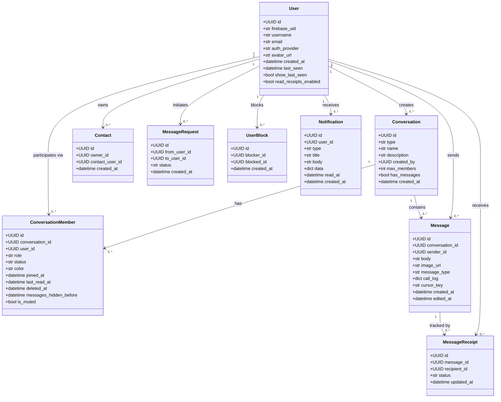
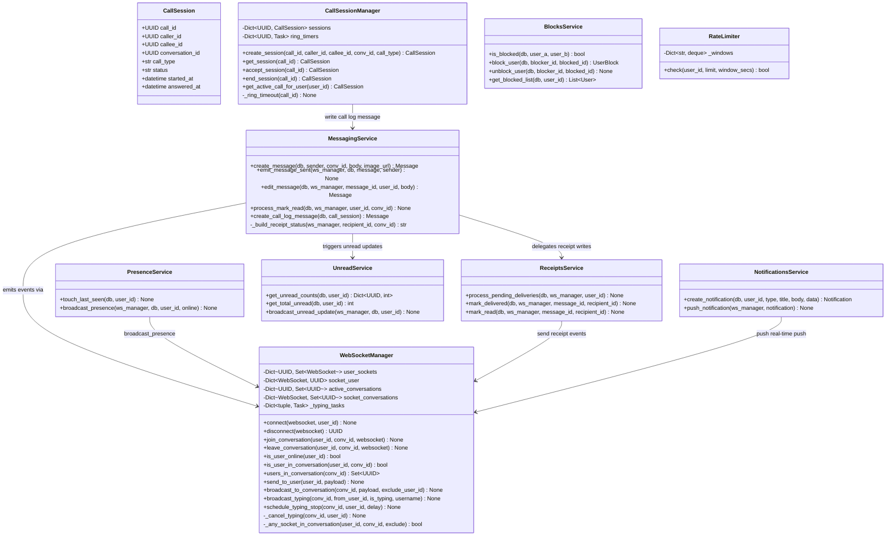
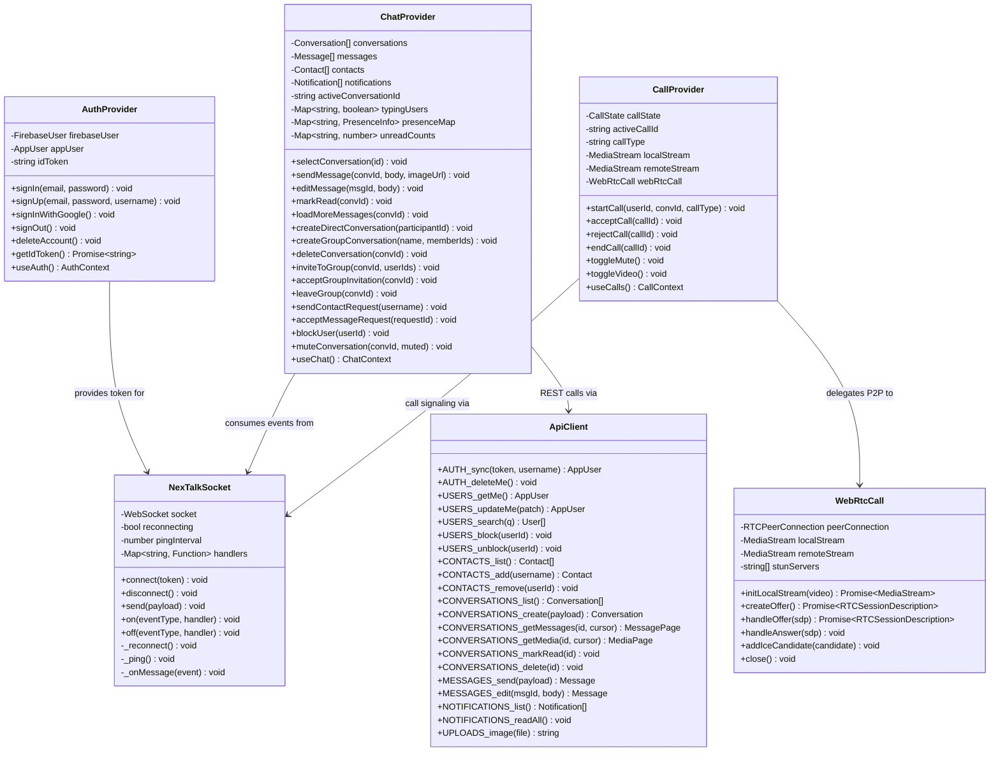
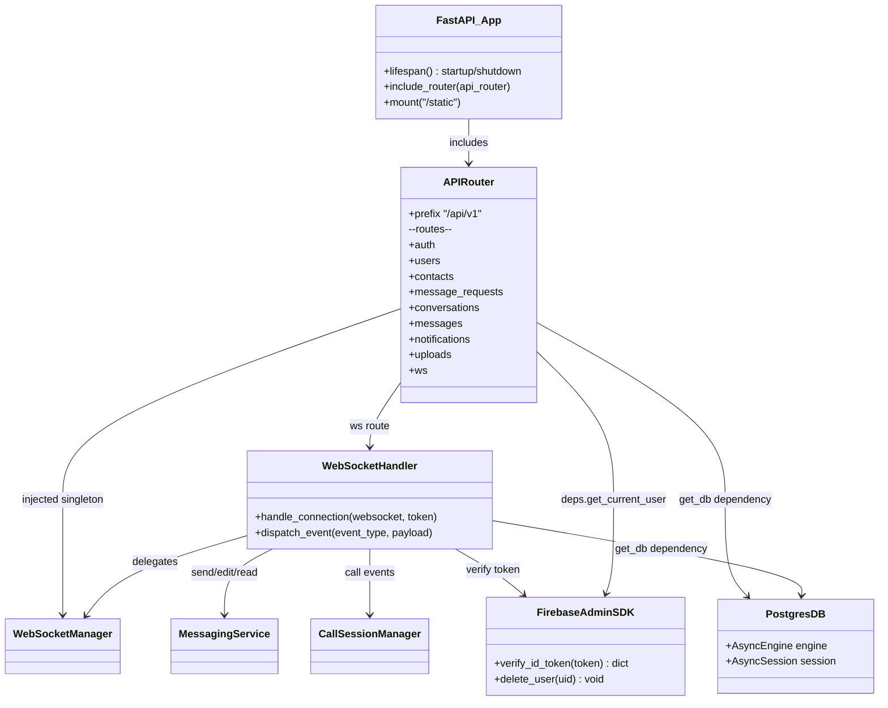

# NexTalk — Class Diagram

> Covers: SQLAlchemy ORM models · Pydantic schemas · Core services · Frontend providers & socket client.
> Grouped by layer for readability. Relationships between layers are shown at the bottom.

---

## 1. Backend — SQLAlchemy ORM Models

---

## 2. Backend — Core Services

---

## 3. Backend — Pydantic WebSocket Event Schemas

```mermaid
classDiagram
    class WsPing {
        +str type = "ping"
    }
    class WsSendMessage {
        +str type = "send_message"
        +UUID conversation_id
        +str body
        +str image_url
        +strip_body() str
    }
    class WsTyping {
        +str type = "typing"
        +UUID conversation_id
        +bool is_typing
    }
    class WsJoinConversation {
        +str type = "join_conversation"
        +UUID conversation_id
    }
    class WsLeaveConversation {
        +str type = "leave_conversation"
        +UUID conversation_id
    }
    class WsMarkRead {
        +str type = "mark_read"
        +UUID conversation_id
    }
    class WsEditMessage {
        +str type = "edit_message"
        +UUID message_id
        +str body
    }
    class WsCallInvite {
        +str type = "call_invite"
        +UUID call_id
        +UUID to_user_id
        +UUID conversation_id
        +str call_type
    }
    class WsCallAccept {
        +str type = "call_accept"
        +UUID call_id
    }
    class WsCallReject {
        +str type = "call_reject"
        +UUID call_id
    }
    class WsCallEnd {
        +str type = "call_end"
        +UUID call_id
    }
    class WsCallOffer {
        +str type = "call_offer"
        +UUID call_id
        +dict sdp
    }
    class WsCallAnswer {
        +str type = "call_answer"
        +UUID call_id
        +dict sdp
    }
    class WsIceCandidate {
        +str type = "ice_candidate"
        +UUID call_id
        +dict candidate
    }
```

---

## 4. Frontend — Core Providers & Hooks

---

## 5. Cross-Layer Relationship Summary

---

## Enum Reference

| Class | Field | Values |
|---|---|---|
| `Conversation` | `type` | `direct` · `group` |
| `ConversationMember` | `role` | `admin` · `member` |
| `ConversationMember` | `status` | `pending` · `accepted` · `rejected` |
| `Message` | `message_type` | `text` · `call` |
| `MessageReceipt` | `status` | `sent` · `delivered` · `read` |
| `MessageRequest` | `status` | `pending` · `accepted` · `declined` |
| `User` | `auth_provider` | `password` · `google.com` |
| `WsCallInvite` | `call_type` | `audio` · `video` |
| `Notification` | `type` | `group_invitation` · `contact_request` · `invitation_accepted` · `invitation_rejected` · `system` |
