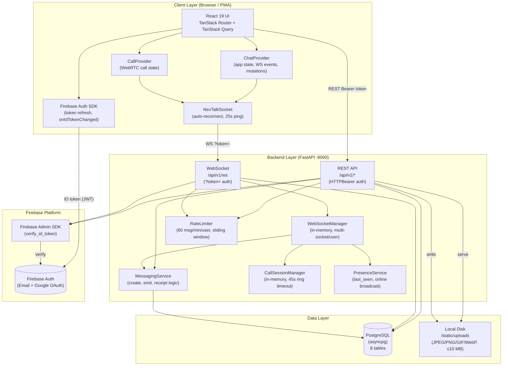
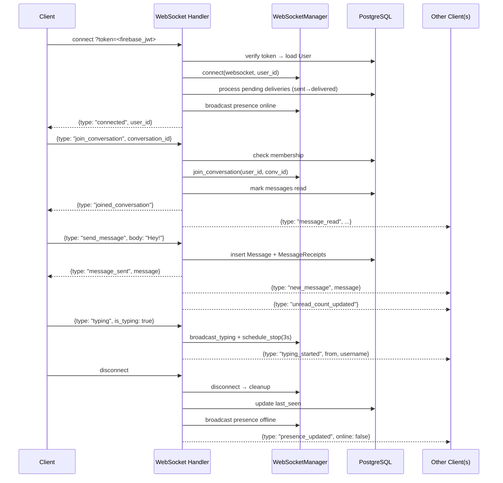
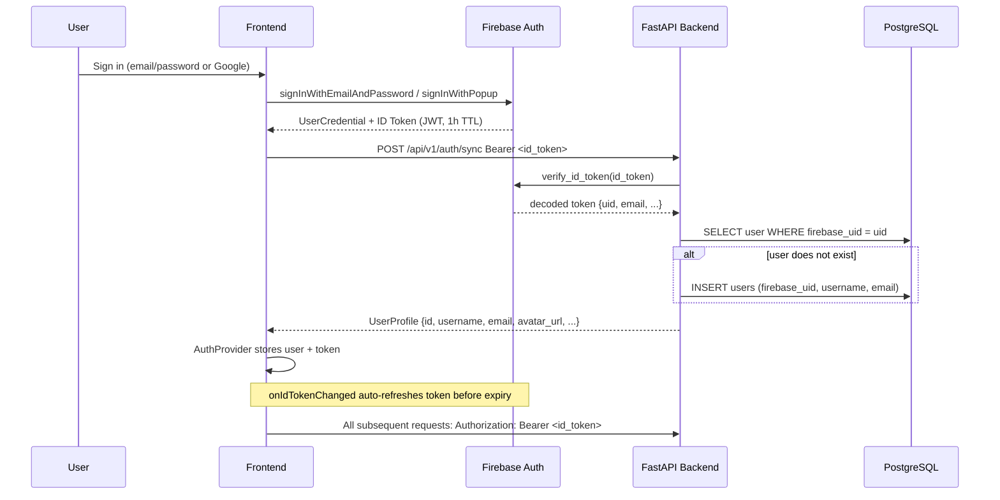
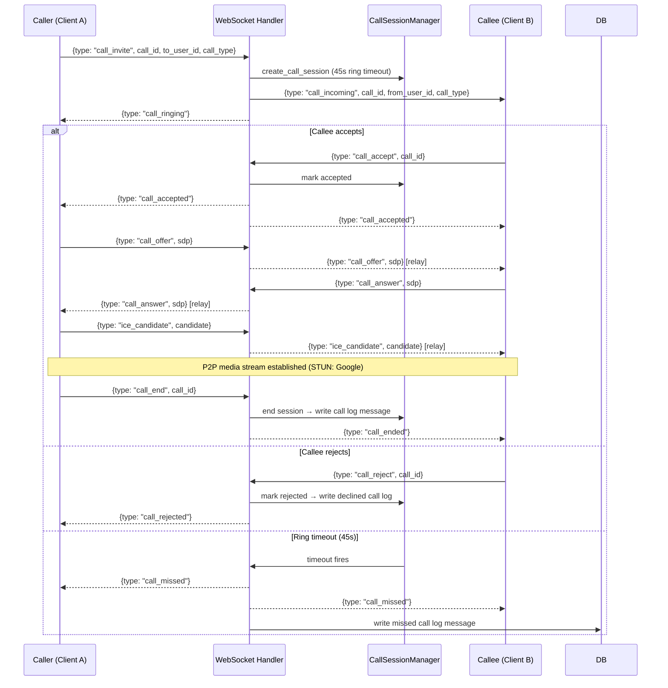
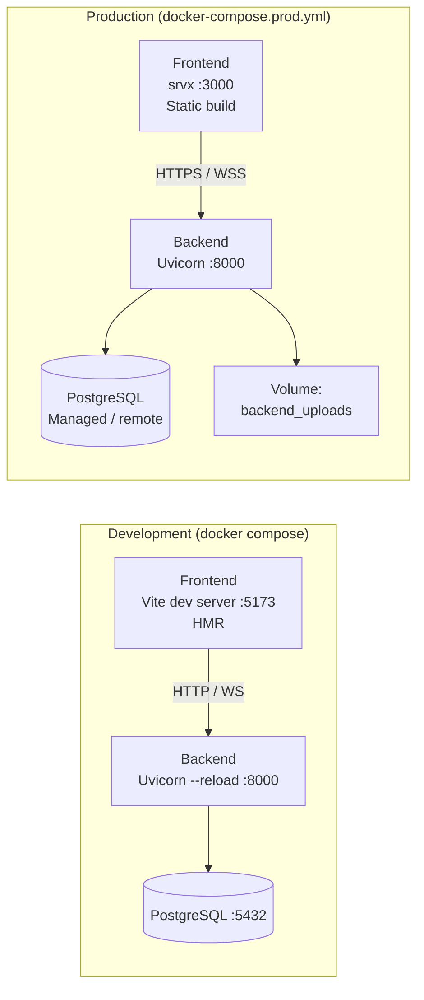

# NexTalk — System Architecture Diagram

> Designed as an experience-first real-time messaging platform.
> Structurally similar to Telegram (multiplexed WebSocket, server-side receipt tracking)
> with Firebase Auth replacing Telegram's phone-number OTP.

---

## High-Level Architecture

---

## WebSocket Event Flow

---

## Authentication Flow

---

## WebRTC Call Flow

---

## Deployment Topology

---

## Notable Design Decisions

| Decision | Rationale |
|---|---|
| **Single multiplexed WebSocket per user** | Same pattern as Telegram Web — one persistent connection handles all conversations; avoids N sockets per browser tab |
| **Firebase Auth (not custom JWT)** | Outsources token rotation, OAuth providers, and revocation; backend only calls `verify_id_token` |
| **ULID cursor keys** for messages | Lexicographically sortable, URL-safe, monotonic within the same ms — enables efficient keyset pagination without `OFFSET` |
| **In-memory `WebSocketManager`** | Simple and fast for a single-server deployment; the stated limitation is no horizontal scale without a Redis pub/sub layer |
| **In-memory `CallSessionManager`** | WebRTC signaling is ephemeral; call metadata (duration, type) is persisted as a `message_type=call` row after the session ends |
| **Soft-delete for conversations** | `deleted_at` + `messages_hidden_before` — mirrors Telegram's "delete for me" where the thread is hidden but not destroyed |
| **Per-recipient `message_receipts`** | Mirrors WhatsApp's tick model: `sent` (✓) → `delivered` (✓✓) → `read` (✓✓ blue), tracked individually |
| **Local disk uploads** | Pragmatic for MVP; the path is `/static/uploads/{uuid}.ext` and should be replaced with object storage (S3/GCS) before horizontal scaling |
